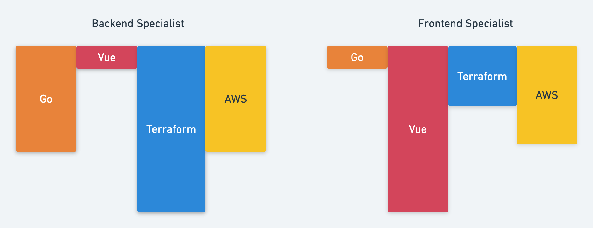

# Platform Assessment

### Contents
- [Welcome](#welcome)
- [Success in Role](#success-in-this-role)
- [Challenge](#challenge)

# Welcome 
😀
If you are reading this, you are a candidate for the platform team.

We are so glad you are here and can't wait to find out if our team is a great fit for both of us.

This repo is designed to help us determine the technical part of that.

# Success in this role
🚀
Our team is made up of "hands on keyboard" folks, you will be expected to wear multiple hats.

Our scope is to build a globally scalable IoT solution that meets local regulations, security compliance,
ultra high performance and uptime, and enables brands to build world class device experiences.

This team will be high challenge and high growth, and requires great time management to make your 40 hours count.

Being 'M' Shaped or full stack.

Our stack comprises [golang](https://golang.org/) services, 100% infrastructure as code with [terraform](https://www.terraform.io/docs/providers/aws/index.html), running in AWS,
with dashboards in [vue.js](https://vuejs.org/). If you haven't heard of all of these, that's ok!

On our team you will be given a lot of autonomy and freedom, ownership of deliverables is expected.
Problems domains will be lightly defined, you will be expected to dig and push to deliver excellent solutions.

This work style isn't for everyone, and that's ok!

Platform Values
- We are big believers in P&G's [PVP](https://us.pg.com/policies-and-practices/purpose-values-and-principles/), and proud to practice them
- Kindness and honesty, your co-workers and partners are human beings.
- Always learning(curiousity), most team members pair program 10-25% of the time, 
 every deliverable is an opportunity to feed into team knowledge.
 - Ownership, you are given areas of responsibility and expected to own those areas. Pushing excellence and asking for help when needed.
 
 If you strongly disagree with any of the above, you likely won't be happy on our team. No hard feelings!
 
 # Challenge
 🏂
 We provide you the following:
 - An AWS account to test with
 - As much time as you need (most folks return this within a couple weeks and spend between 2-4 hours)
 - An open back and forth with any questions or concerns you have
 
 Success looks like the following:
 - You'll need an auth system, you get to choose here. You can go with a SAAS offering (Cognito, Auth0, Okta) or build your own. Must support Token or Basic Auth.
 - Build 2 API endpoints. You can build these on whatever compute you choose with any supported language, lambda, fargate, EC2. You choose! (for reference we like Go with Lambda)
    - Endpoint 1: PUT updateUser, with the following custom attributes.
        - Hogwarts house in camelCase (hogwartsHouse), a string / enum value with options of (Gryffindor, Slytherin, Ravenclaw, Hufflepuff)
        - Last Updated in [ISO-8601](https://en.wikipedia.org/wiki/ISO_8601) Datetime camelCase (lastUpdated), a string date format. (for reference we like 2020-04-14T13:13:13+00:00)
        - Where you store these attributes is up to you? SQL database for user metadata, redis, inside the auth system if supported. All acceptable choices, just be prepared to answer the 'why?'
   - Endpoint 2: GET getUser and will return email, hogwartsHouse, and lastUpdated
- Both of these need to live at https://YOURURL/api/v1/users and should return a status code of 200 along with the 3 attributes
- All (or most!) of the infrastructure you provision should be deployed with terraform. This is a hard requirement.
- Set Environment variable CHALLENGE_URL to YOURURL
- Set the Environment variable AUTH_HEADER to your authorization header ("basic BASE64USERPASS==" or "bearer JWTOKEN")
- Run E2E tests in Go (regardless of what language you ran you'll need to install Go for this)
- Upload your code to a github repo and ping us with instructions on how to generate the auth header.

Hard Rules:
- Using 3rd party libraries, google, stackoverflow, emailing questions to us for help; all perfectly acceptable and encouraged.
However you must write the code, copying gists is fine but someone else writing the code for you breaks our 'honesty' value. This needs to be your work. (Don't ask your friend to write it for you, and if you find a fork of this on the web, don't copy from it.)
- Infrastructure has to be provisioned with mostly terraform, only acceptable reasons why not will be that a terraform provider wasn't available.
- You can't change any existing code in the repo. Updating the tests to accept a 500 status code is clever... but not what we are looking for.
   
 
